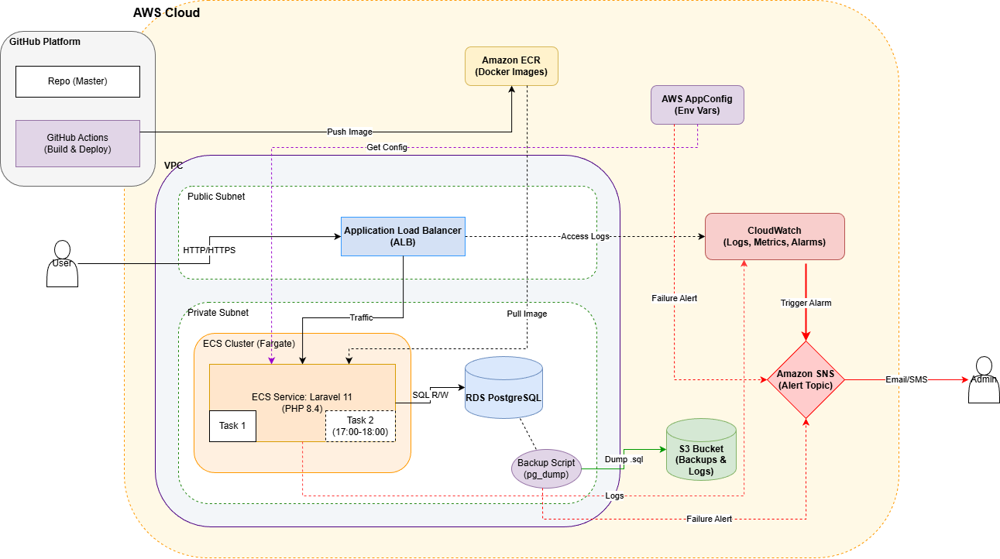

# PHP Laravel 应用 AWS 部署项目

本项目是一个完整的 PHP Laravel 11 应用在 AWS 上的部署方案，包含 CI/CD、监控告警、自动备份等功能。

##  文档索引

1. **核心步骤文档**：[核心步骤.md](核心步骤.md)
   - 详细的部署步骤和配置说明

2. **架构图**：

3. **触发告警截图**：[触发告警截图.md](触发告警截图.md)
   - 各种告警场景的测试截图

##  相关代码仓库

- **Laravel应用部署与CI/CD（主要）**：https://github.com/fyfighting0/laravel-deployment
- **RDS PostgreSQL自动备份**：https://github.com/fyfighting0/RDS_PG_Automatic_backup
- **项目其它代码（Lambda函数）**：https://github.com/fyfighting0/lavavel_other_code

##  AWS 平台功能链接
目前配置好的服务可通过此链接访问：http://laravel-alb-768515851.ap-northeast-1.elb.amazonaws.com/ , 其他用到的AWS的各种组件如下：
- **AppConfig**：https://ap-northeast-1.console.aws.amazon.com/systems-manager/appconfig/applications?region=ap-northeast-1
- **EventBridge**：https://ap-northeast-1.console.aws.amazon.com/events/home?region=ap-northeast-1#/rules
- **SNS**：https://ap-northeast-1.console.aws.amazon.com/sns/v3/home?region=ap-northeast-1#/topics
- **Lambda**：https://ap-northeast-1.console.aws.amazon.com/lambda/home?region=ap-northeast-1#/functions
- **ECS Service**：https://ap-northeast-1.console.aws.amazon.com/ecs/v2/clusters/laravel-cluster-0/services?region=ap-northeast-1
- **ECS Task Definitions**：https://ap-northeast-1.console.aws.amazon.com/ecs/v2/task-definitions?region=ap-northeast-1
- **ECR**：https://ap-northeast-1.console.aws.amazon.com/ecr/private-registry/repositories?region=ap-northeast-1
- **S3**：https://ap-northeast-1.console.aws.amazon.com/s3/buckets?region=ap-northeast-1
- **IAM**：https://us-east-1.console.aws.amazon.com/iam/home?region=ap-northeast-1#/home
- **CloudWatch**：https://ap-northeast-1.console.aws.amazon.com/cloudwatch/home?region=ap-northeast-1#logsV2:log-groups
- **RDS**：https://ap-northeast-1.console.aws.amazon.com/rds/home?region=ap-northeast-1
- **Load Balancer**：https://ap-northeast-1.console.aws.amazon.com/ec2/home?region=ap-northeast-1#LoadBalancers
- **Dashboard**：https://ap-northeast-1.console.aws.amazon.com/cloudwatch/home?region=ap-northeast-1#dashboards
- **Alarms**：https://ap-northeast-1.console.aws.amazon.com/cloudwatch/home?region=ap-northeast-1#alarmsV2:
