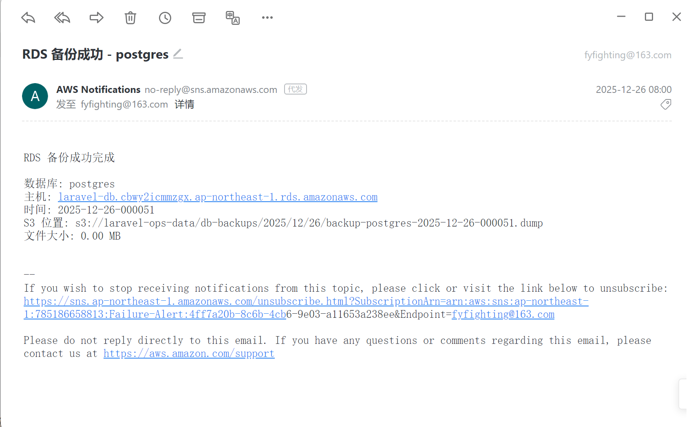
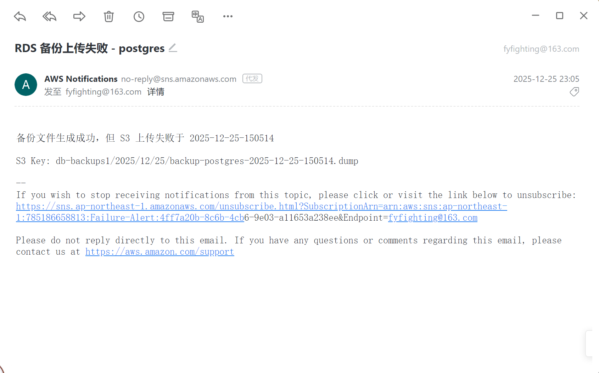
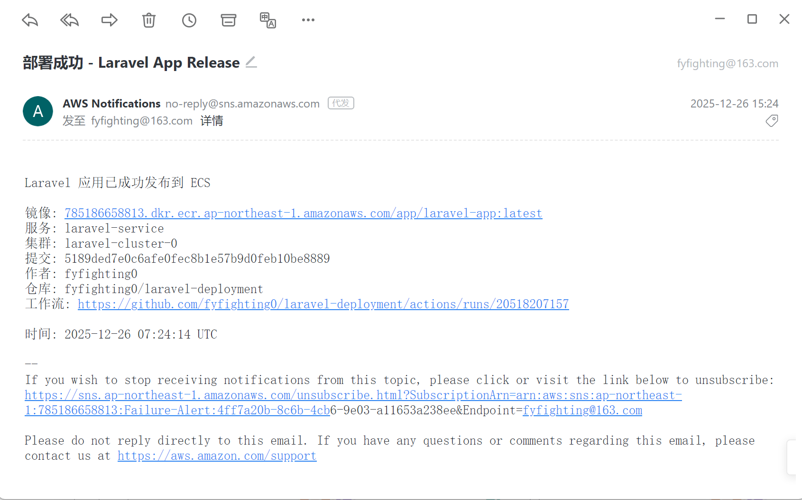
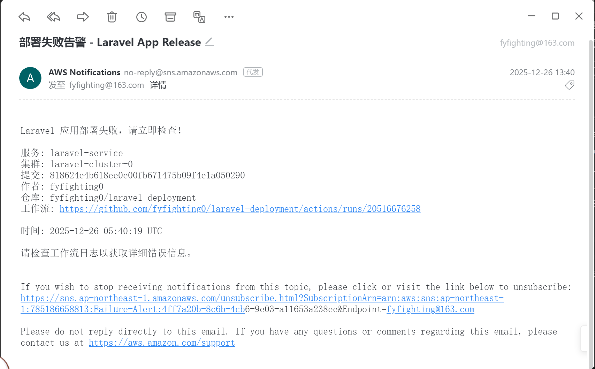
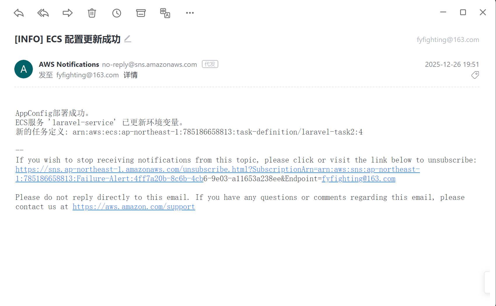
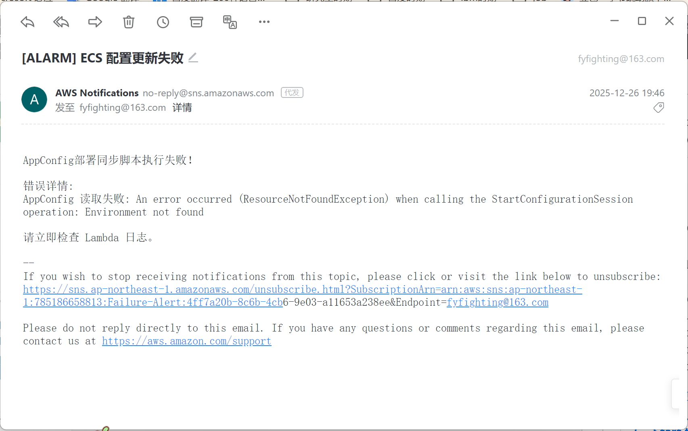
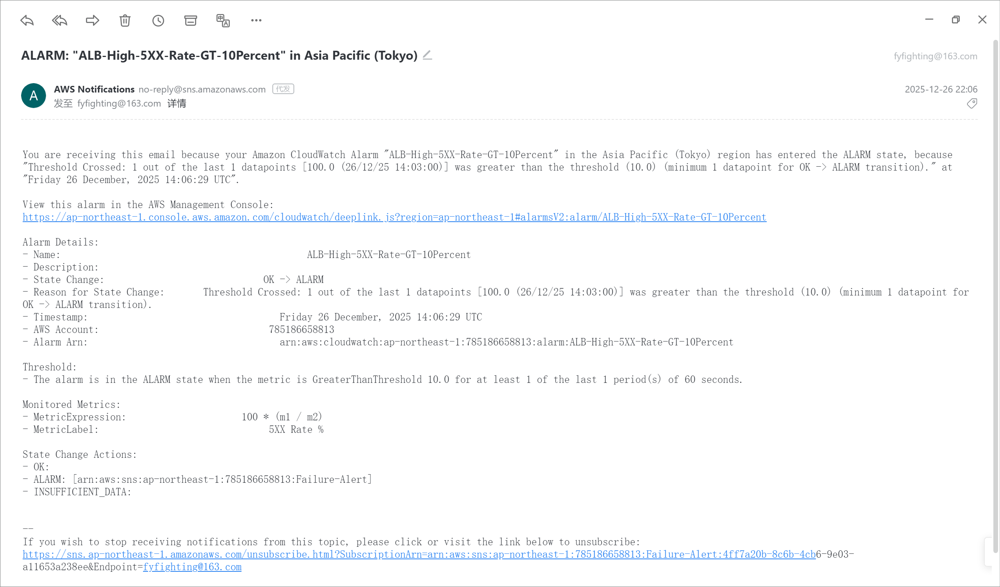

## 核心步骤：

### 一：应用代码与 Docker 镜像 （https://github.com/fyfighting0/laravel-deployment）

#### 1. 创建 Laravel 11文件

#### 2. 创建 Dockerfile

### 二：AWS 基础资源搭建 （UI）

#### 1. 创建 ECR (Elastic Container Registry)

#### 2. 创建 RDS (PostgreSQL)

#### 3. 创建 S3 存储桶 

（1） 创建两个文件夹：`alb-logs/` 和 `db-backups/`，分别存储load balancer的log和数据库的备份。

### 三：部署 ECS 应用与 Load Balancer (UI)

#### 1. 创建 CloudWatch Log Group

#### 2. 创建 Application Load Balancer (ALB)

（1）配置ALB 开启Access logs，将日志写入 S3 桶（alb-logs）（需要在S3的bucket policy中配置ALB的权限）

（2）配置 Lambda 函数，并增加trigger。（使写入S3桶中的日志传到CloudWatch中）（https://github.com/fyfighting0/lavavel_other_code）

#### 3. 创建 ECS Task Definition

其中将ECR中的image配置成这里的container。

配置将log写入CloudWatch：/ecs/laravel-app（完成要求一.3和要求一.4）

#### 4. 创建 ECS Cluster & Service

其中配置上ECS Task Definition，启动任务（完成要求一.1和要求一.2）。

并且配置上创建的load balancer（完成要求一.5）

并在service中设置定期扩缩容（完成要求一.6）

### 四：RDS 每日 Dump 备份到 S3 (完成要求一.7) - (https://github.com/fyfighting0/RDS_PG_Automatic_backup)

1.构建备份数据库dump到S3的脚本为 Docker 镜像，并推送到到ECR

2.创建role，设置权限

3.根据image创建 ECS 任务定义

4.设置安全组

5.在ECS 的cluster中创建定时任务，每日凌晨跑iamge中的脚本，其中通过调用SNS进行报警。

6.在cluster中可直接触发执行任务进行测试，成功触发通知：

通过设置不存在的S3桶名称触发执行任务，成功触发告警：

### 五：GitHub CI/CD (要求二) 

在 GitHub 仓库创建 `.github/workflows/deploy.yml`
1. 检出代码（推送到 `master` 分支和合并 PR 到 `master` 分支触发）
2. 配置 AWS 凭证
3. 登录到 Amazon ECR
4. 构建 Docker 镜像
5. 推送镜像到 ECR
6. 强制更新 ECS Service 部署（`--force-new-deployment`）
7. 等待服务稳定
8. 通过 AWS SNS 发送通知（成功/失败）

在master中push或者merge到master，成功触发通知：

通过设置有问题的dockerfile，成功触发部署失败告警：

### 六：AppConfig (要求三)

1. 创建 AppConfig:配置环境变量。

2. 创建lambada函数(其中拉取appconfig中的配置，传递给ECS service，更新task，并配置SNS) ---- 实现配置要交付到 ECS Service。（https://github.com/fyfighting0/lavavel_other_code）

3. 创建EventBridge，设置监控到AppConfig部署已完成，就调用lambda函数，否则配置SNS进行报警(需要创建建扩展关联)。-----实现同步更新

修改AppConfig的环境变量，触发重新部署，成功触发通知：

通过设置不对的ECS路径与名字，成功触发部署失败告警：

### 七：监控与告警 (要求四)

2、设置 dashboard，关注 ECS 的 service 指标（副本数量；内存、CPU 指标）
3、设置 dashboard，关注 Load balancer http status 统计
4、设置日志监控，当应用产生的日志中包含 ERROR 时，触发告警
5、设置监控，当 Load balancer 的 500 status 比例高于 10% 时，触发告警

#### 1. ERROR 告警
（1）先创建 metric filter，填写Filter pattern:ERROR
（2）在创建好的 Filter 上点击 **Create alarm**。
（3）设置Threshold type: **Static** -> Greater/Equal **1**。
（4）设置SNS

使用AWS CLI 注入日志方法或直接在UI上创建一个带有ERROR的LOG触发告警:
aws logs put-log-events --log-group-name /ecs/laravel-task2 --log-stream-name ecs/app/04a7bb3b06d24defb8230ad177afbe48 --log-events "timestamp=$timestamp,message='[ERROR] Simulation alarm triggered by PowerShell'" --region ap-northeast-1

#### 2. Load Balancer 500告警
（1）创建 alarm -> **Select metric**。
（2）搜索 **ApplicationELB** -> **Per AppELB Metrics**。
（3）搜索 `HTTPCode_ELB_5XX_Count` 和 `RequestCount`。
（4）点击 **Graphed metrics** tab -> Add math ->  输入 `m1 / m2 * 100` (m1 是 5XX, m2 是总请求)。
（5）设置Threshold type: **Static** ，Greater than **10** (即 10%)。
（6）设置 SNS

在Laravel项目中，增加一个路由进行测试，让它直接抛出500异常。在浏览器多次刷这个接口，从而触发告警。

#### 3. Dashboard 
1.创建dashboard
2. Add widget -> Line:
   - Namespace `ECS`, Metric `CPUUtilization`, `MemoryUtilization`
   - Namespace `ECS`, Metric `RunningTaskCount`, `DesiredTaskCount` 
3. Add widget ->Stacked area
   - Namespace `ApplicationELB`, Metrics `HTTPCode_ELB_2XX_Count`, `HTTPCode_ELB_3XX_Count`,`HTTPCode_ELB_4XX_Count`,`HTTPCode_ELB_5XX_Count`。
